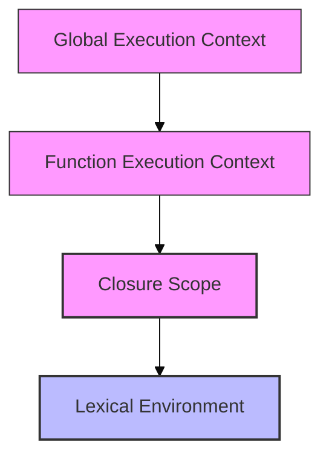
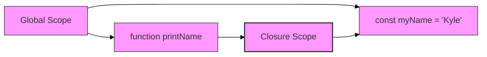
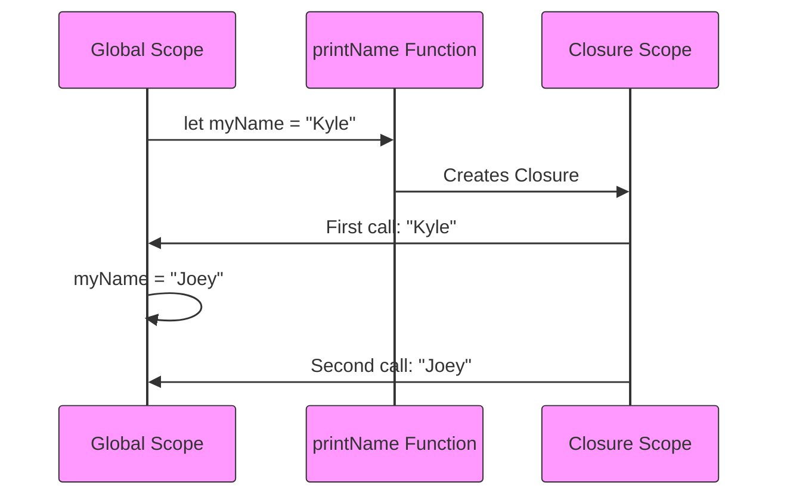
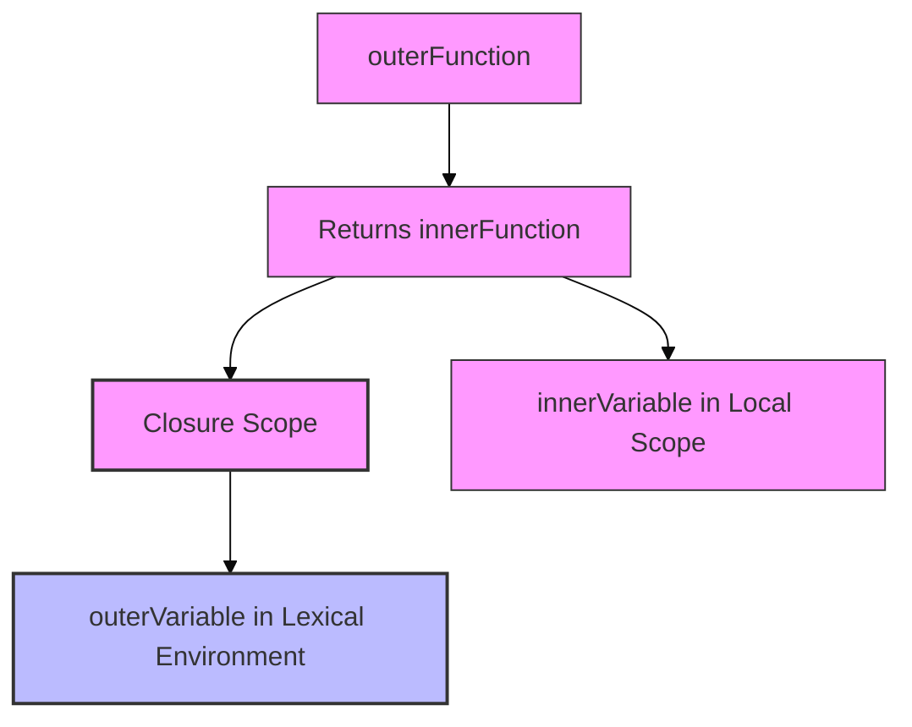
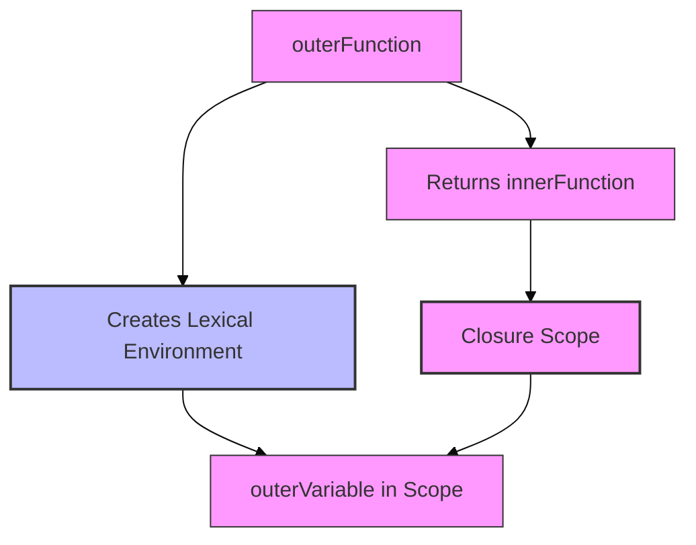
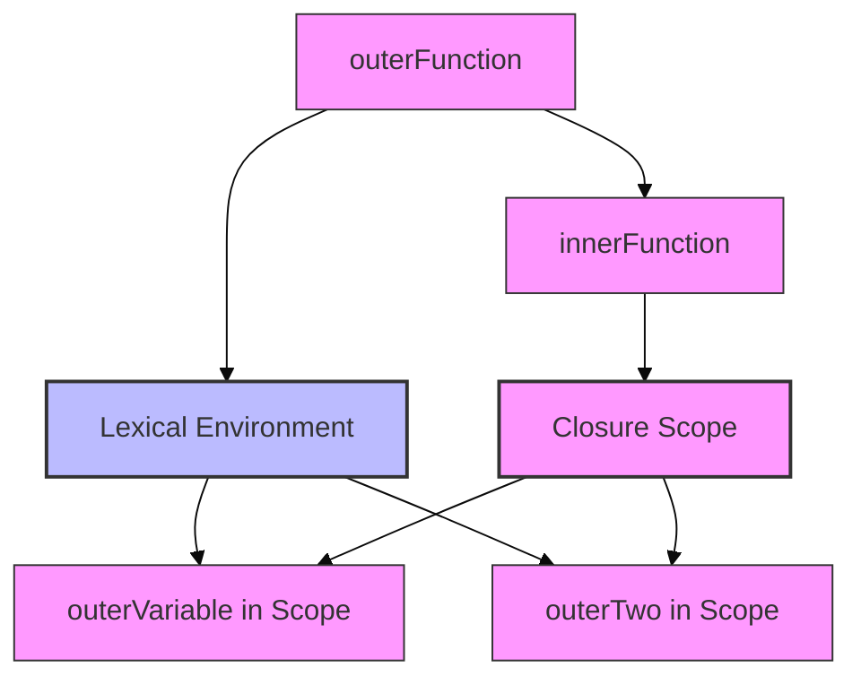
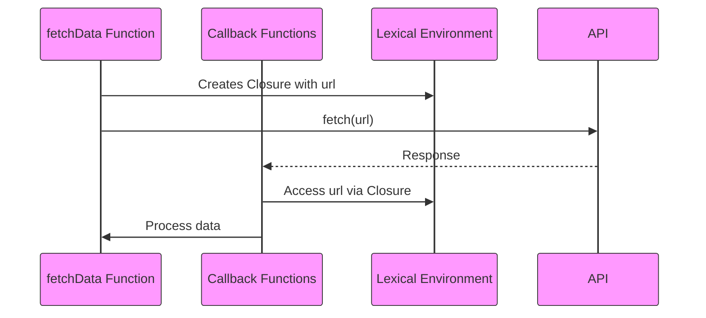

# Learn JavaScript Closures in 7 Minutes

Welcome to this quick and concise guide on JavaScript closures. By the end of this document, you will understand what closures are, how they work, and why they are so useful.

## What Is a Closure?

A closure is a feature in JavaScript where an inner function has access to the variables of its outer function, even after the outer function has finished executing. In other words, a closure "remembers" the environment in which it was created.



## Basic Example

```javascript
const myName = "Kyle";

function printName() {
  console.log(myName);
}

printName(); // Output: Kyle
```



## Dynamic Variable Access in Closures

Closures access the current value of variables at the time the inner function is called, not when it was created:

```javascript
let myName = "Kyle";

function printName() {
  console.log(myName);
}

printName(); // Kyle

myName = "Joey";

printName(); // Joey
```



## Closures with Functions Returning Functions

```javascript
function outerFunction(outerVariable) {
  return function innerFunction(innerVariable) {
    console.log('Outer Variable:', outerVariable);
    console.log('Inner Variable:', innerVariable);
  };
}

const newFunction = outerFunction('outside');
newFunction('inside');
```



## How Closures Work Behind the Scenes

```javascript
function outerFunction() {
  const outerVariable = 'outside';

  return function innerFunction() {
    console.log(outerVariable);
  };
}

const myInnerFunction = outerFunction();
myInnerFunction(); // Output: outside
```



## Accessing Multiple Outer Variables

```javascript
function outerFunction() {
  const outerVariable = 'outside';
  const outerTwo = 'hi';

  return function innerFunction() {
    console.log(outerVariable);
    console.log(outerTwo);
  };
}

const myInnerFunction = outerFunction();
myInnerFunction();
```



## Real-World Use Case: Closures in Asynchronous Code

```javascript
function fetchData(url) {
  fetch(url)
    .then(response => response.json())
    .then(data => {
      console.log('Fetched from:', url);
      console.log(data);
    });
}

fetchData('https://api.example.com/data');
```



## Summary

- Closure is when an inner function retains access to variables from its outer scope
- Closures allow functions to have "private" variables and maintain state
- They are foundational to patterns like function factories, callbacks, and module patterns

## Further Learning

Explore more about closures and advanced JavaScript topics through tutorials, videos, and documentation.

---

*Keep experimenting with closures — they are a powerful tool in your JavaScript toolkit!*