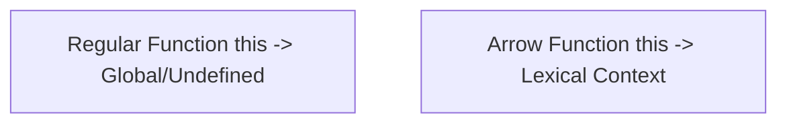

# JavaScript Mastery for React Developer Interviews

## 1. Understanding `this`

### Global Scope
```js
console.log(this); // Window (in browsers)
```

### Regular Function
```js
function test() {
  console.log(this);
}
test(); // Window or undefined (strict mode)
```

### Object Method
```js
const obj = {
  name: "GPT",
  sayHi() {
    console.log(this.name);
  }
};
obj.sayHi(); // "GPT"
```

### Event Listener
```js
element.addEventListener('click', function() {
  console.log(this); // refers to the element
});
```

---

## 2. Arrow Functions vs Regular Functions

| Feature                  | Regular Function | Arrow Function |
|--------------------------|------------------|----------------|
| Has its own `this`?      | ✅ Yes           | ❌ No          |
| Suitable for methods?    | ✅ Yes           | ⚠️ No         |
| Context-safe for callbacks? | ⚠️ Depends  | ✅ Yes         |

```js
const obj = {
  name: 'JS',
  regular() {
    setTimeout(function () {
      console.log(this.name);
    }, 1000);
  },
  arrow() {
    setTimeout(() => {
      console.log(this.name);
    }, 1000);
  }
};

obj.regular(); // undefined
obj.arrow(); // 'JS'
```

### Mermaid Context Comparison



---

## 3. call / apply / bind

### call:
```js
greet.call(person, arg1, arg2);
```

### apply:
```js
greet.apply(person, [arg1, arg2]);
```

### bind:
```js
const bound = greet.bind(person);
bound(arg1);
```

```js
function greet(age) {
  console.log(`${this.name} is ${age}`);
}
const person = { name: 'Alice' };
greet.call(person, 25);       // Alice is 25
greet.apply(person, [30]);    // Alice is 30
const bound = greet.bind(person);
bound(35);                    // Alice is 35
```

---

## 4. Polyfill for .bind()

```js
Function.prototype.myBind = function(context, ...args1) {
  const fn = this;
  return function(...args2) {
    return fn.apply(context, [...args1, ...args2]);
  };
};

function sayHi(greeting) {
  console.log(`${greeting}, ${this.name}`);
}
const user = { name: "Bob" };
const boundFn = sayHi.myBind(user, "Hello");
boundFn(); // Hello, Bob
```

---

## Quiz Section

- Q1: `person.greet()();` (regular function inside method) → ✅ A1: undefined
- Q2: `person.greet()();` (arrow function inside method) → ✅ A2: "Tom"
- Q3: `sayName.bind(user)()` → ✅ A3: "Neo"
- Q4: `const say = person.sayName; say();` → ✅ A4: "Global"
- Q5: `setTimeout(function...)` inside method → ✅ A5: undefined
- Q6: `setTimeout(() => ...)` inside method → ✅ A6: "Charlie"
- Q7: `user.sayHi.call(admin)` → ✅ A7: "Admin"
- Q8: arrow function in object context → ✅ A8: "Window"
- Q9: `const inc = obj.inc; inc();` → ✅ A9: NaN
- Q10:
```js
console.log(unboundGetX()); // undefined
console.log(boundGetX());   // 42
```
✅ A10: undefined, 42

---

## Platforms to Practice

- [JS Tutor](https://pythontutor.com/javascript.html)
- [LeetCode (JS)](https://leetcode.com/problemset/all/?topicSlugs=javascript)
- [Codewars](https://www.codewars.com/kata/search/javascript?q=this%20arrow)
- [Exercism.io](https://exercism.io/tracks/javascript/exercises)
- [JavaScript.info Tasks](https://javascript.info/task)
- [Frontend Masters Exercises](https://github.com/FrontendMasters/js-exercises)
