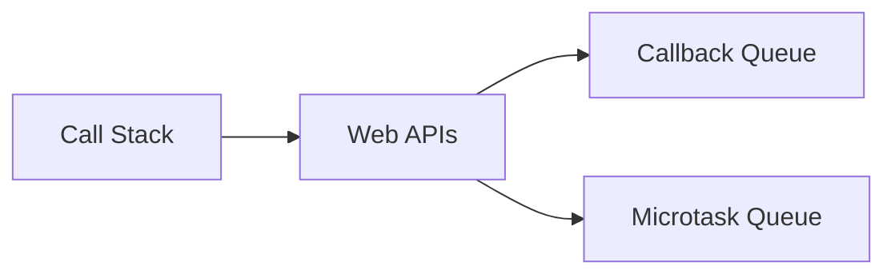

# JavaScript: Asynchronous JavaScript (Callbacks → Promises → Async/Await)

A practical and concise guide for mastering Async JS for React Developer Interviews.

---

## 🔁 1. What is Asynchronous JavaScript?

JavaScript is single-threaded. Asynchronous programming helps execute long-running tasks (like fetching data) **without blocking** the main thread.

---

## 🔄 2. Callbacks

### 🔸 Callback Function
A function passed into another function to be executed later.

```js
function getData(callback) {
  setTimeout(() => {
    callback("Data fetched");
  }, 1000);
}

getData((data) => console.log(data));
```

### ❌ Callback Hell

```js
loginUser("user", () => {
  getProfile(() => {
    getPosts(() => {
      // deeply nested
    });
  });
});
```

---

## ⛓️ 3. Promises

### 🔸 What is a Promise?
An object representing the eventual completion or failure of an async operation.

```js
const promise = new Promise((resolve, reject) => {
  setTimeout(() => resolve("Done!"), 1000);
});

promise.then(data => console.log(data));
```

### 🔸 Chaining Promises

```js
loginUser("user")
  .then(getProfile)
  .then(getPosts)
  .then(posts => console.log(posts))
  .catch(err => console.error(err));
```

---

## 💤 4. Async/Await

### 🔸 Syntax sugar over Promises
Allows writing asynchronous code in a synchronous manner.

```js
async function fetchData() {
  try {
    const user = await loginUser("user");
    const profile = await getProfile(user);
    const posts = await getPosts(profile);
    console.log(posts);
  } catch (error) {
    console.error(error);
  }
}
```

### 🔁 Convert Callbacks → Promises → Async/Await

#### 🟠 Callbacks

```js
function fetchUser(callback) {
  setTimeout(() => callback("User"), 1000);
}
```

#### 🟢 Promises

```js
function fetchUser() {
  return new Promise(resolve => {
    setTimeout(() => resolve("User"), 1000);
  });
}
```

#### 🔵 Async/Await

```js
async function getUser() {
  const user = await fetchUser();
  console.log(user);
}
```

---

## 🧠 5. Event Loop & Microtasks

### 🔸 Call Stack, Web APIs, Callback Queue, Microtask Queue



### 🔸 Example

```js
console.log("Start");

setTimeout(() => {
  console.log("Timeout");
}, 0);

Promise.resolve().then(() => {
  console.log("Microtask");
});

console.log("End");
```

🔹 Output:
```
Start
End
Microtask
Timeout
```

Microtasks (Promises) run **before** setTimeout due to priority in event loop.

---

## 🎮 6. Quiz

**Q1.** What’s the output?

```js
console.log("A");
setTimeout(() => console.log("B"), 0);
Promise.resolve().then(() => console.log("C"));
console.log("D");
```

✅ Answer: A, D, C, B

**Q2.** Convert this callback code to async/await

```js
getUser(function(user) {
  getProfile(user, function(profile) {
    console.log(profile);
  });
});
```

✅ Solution:

```js
async function fetchProfile() {
  const user = await getUser();
  const profile = await getProfile(user);
  console.log(profile);
}
```

---

## 💻 Practice Platforms

- [JavaScript.info - Async](https://javascript.info/async)
- [Promises Playground - Latency Demo](https://bevacqua.github.io/promisees/)
- [Codewars Async JS Challenges](https://www.codewars.com/kata/search/javascript?q=async)
- [Frontend Masters Event Loop Visualizer](https://www.frontendmasters.com/blog/javascript-event-loop/)

---

**Next Up: Closures & Scope or Advanced Browser Internals? Let me know!**
