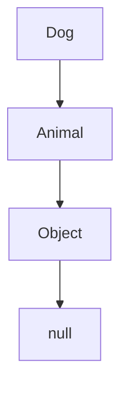

# JavaScript: Prototypes, Inheritance & Classes

A concise and powerful guide for React Developer Interviews.

---

## 🔁 1. Understanding `__proto__` and `prototype`

### `__proto__`
- Every JavaScript object has an internal property called `[[Prototype]]`, accessible using `__proto__`.
- It points to the prototype of the object from which it inherits.

```js
const obj = {};
console.log(obj.__proto__ === Object.prototype); // true
```

### `.prototype`
- Only functions (especially constructor functions) have the `.prototype` property.
- This is used to define methods/properties that all instances should share.

```js
function Person(name) {
  this.name = name;
}
Person.prototype.greet = function() {
  return `Hello, ${this.name}`;
};
```

---

## 🧬 2. The Prototype Chain

- If a property or method is not found on an object, JS looks up the prototype chain.
- This continues until the property is found or the chain ends at `null`.

```js
const arr = [];
console.log(arr.__proto__ === Array.prototype); // true
console.log(arr.toString()); // from Object.prototype
```

### Prototype Chain Example in Mermaid


---

## 🔧 3. Constructor Functions

Before classes, JS developers used constructor functions to mimic class-like behavior.

```js
function Animal(name) {
  this.name = name;
}
Animal.prototype.speak = function () {
  console.log(`${this.name} makes a noise.`);
};

const dog = new Animal("Buddy");
dog.speak(); // Buddy makes a noise.
```

- Shared methods are defined on the prototype to save memory.

---

## 🏛️ 4. ES6 Classes

JavaScript `class` syntax is a cleaner way to work with prototypes and inheritance.

```js
class Animal {
  constructor(name) {
    this.name = name;
  }

  speak() {
    console.log(`${this.name} makes a noise.`);
  }
}
```

- Under the hood, it's still using prototypes.

---

## 👨‍👧 5. Inheritance with `extends` and `super`

`extends` is used for class inheritance.

```js
class Dog extends Animal {
  constructor(name) {
    super(name); // must call super() before using 'this'
  }

  speak() {
    console.log(`${this.name} barks.`);
  }
}
```

- `super()` calls the parent constructor.
- `super.method()` is used to call a method from the parent class.

---

## 🎮 6. Adding Custom Methods

```js
class Animal {
  constructor(name) {
    this.name = name;
  }
}

class Dog extends Animal {
  fetch() {
    return `${this.name} fetched the ball!`;
  }
}

const d = new Dog("Rocky");
console.log(d.fetch()); // Rocky fetched the ball!
```

- Custom methods can be added to the subclass as needed.

---

## 🚫 7. Pitfalls to Avoid

- ❌ Forgetting `super()` in a subclass constructor.
- ❌ Using arrow functions for instance methods (breaks `this` context).
- ❌ Assuming prototype changes affect existing instances.

---

## ✅ Quick Interview Quiz

**Q1.** What’s the output?

```js
class A {
  constructor() {
    this.name = "A";
  }
}
class B extends A {
  constructor() {
    super();
    this.name = "B";
  }
}
const b = new B();
console.log(b.name); // B
```

**Q2.** Can arrow functions be used for class methods?  
→ ⚠️ No. Arrow functions don’t have their own `this`, which can cause unexpected behaviors in classes.

**Q3.** What’s the prototype of an object created with `new Animal()`?  
→ ✅ `Animal.prototype`

**Q4.** Write a `Dog` class extending `Animal` with a `bark()` method.

```js
class Animal {
  constructor(name) {
    this.name = name;
  }
}
class Dog extends Animal {
  bark() {
    return `${this.name} says woof!`;
  }
}
```

---

## 💻 Practice Platforms

- [JavaScript.info - Prototypes](https://javascript.info/prototype-inheritance)
- [Codewars - JS Prototypes](https://www.codewars.com/kata/search/javascript?q=prototype%20class)
- [Frontend Masters - JS Exercises](https://github.com/FrontendMasters/js-exercises)
- [LeetCode - JavaScript Problems](https://leetcode.com/problemset/all/?topicSlugs=javascript)

---

**Next Up: Async JS, Promises & Event Loop? Let me know!**
